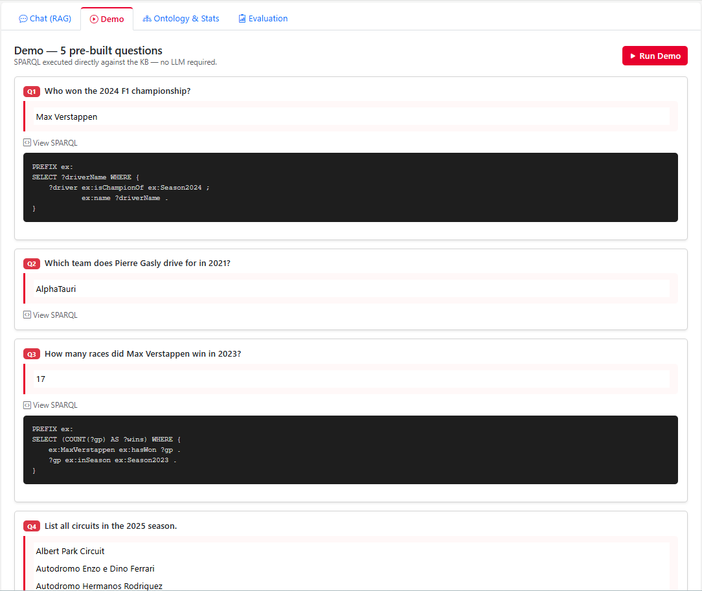
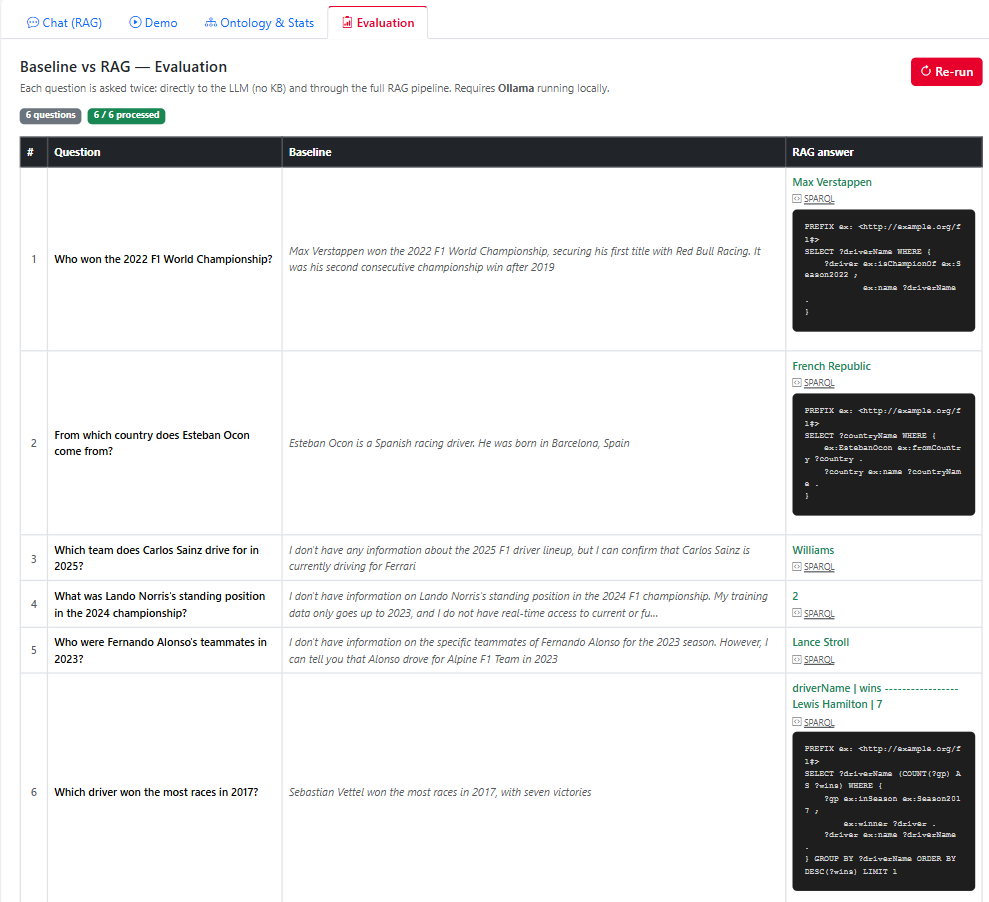
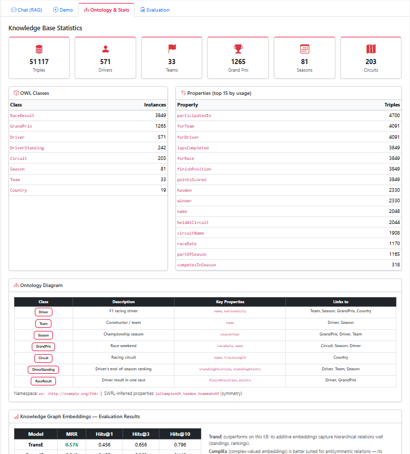
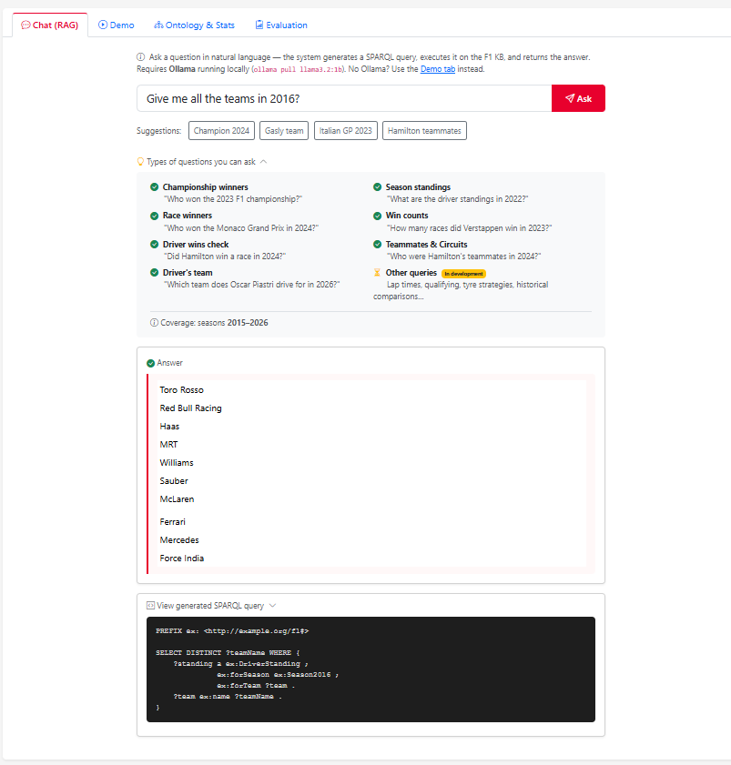

# F1 Knowledge Graph — Web Datamining & Semantics - Martin Hasson and Hugo Deberne - DIA3

Formula 1 knowledge graph pipeline: web crawling → information extraction → RDF KB → OWL reasoning → Knowledge Graph Embeddings → RAG Q&A.

**Domain:** Formula 1 (seasons 2015–2027)
**Namespace:** `ex: <http://example.org/f1#>`
**KB size:** 51,030 triples

---

## Installation

```bash
pip install -r requirements.txt
pip install torch --index-url https://download.pytorch.org/whl/cpu
playwright install chromium
```

---

## Complete Pipeline (in order)

### Step 1 — Crawl standings (formula1.com)

```bash
python src/crawl/crawl_formula1.py            # last 12 seasons (default)
```

Produces `data/raw/formula1/{year}/{drivers,teams,races}.json`.

### Step 2 — Extract standings + NER

```bash
python src/ie/extract_drivers.py
python src/ie/extract_teams.py
python src/ie/ner.py                  # NER annotation layer (requires spaCy)
```

Produces `data/extracted/drivers_{year}.json`, `teams_{year}.json`,
and `data/extracted/ner_examples.json` (20 annotated sentences, 3 ambiguity cases).

> **spaCy model (first run only):**
> ```bash
> pip install spacy
> python -m spacy download en_core_web_sm
> ```

### Step 3 — Crawl individual race results (formula1.com)

```bash
python src/crawl/crawl_race_results.py            # last 10 seasons (default)
python src/crawl/crawl_race_results.py --keep 5   # limit to 5 seasons
python src/crawl/crawl_race_results.py --year 2024 # single season
```

Produces `data/raw/formula1/{year}/race_results/{race}.json`.

### Step 4 — Extract race results

```bash
python src/ie/extract_race_results.py
```

Produces `data/interim/race_results_{year}.json`.

### Step 5 — Build private RDF KB

```bash
python src/kg/build_kb.py                # drivers + standings → auto_kg.ttl
python src/kg/build_local_expansion.py   # circuits, calendars, teams → expanded_kb.ttl
python src/kg/build_race_results_kg.py   # race results → +~43k triples
```

### Step 6 — Entity alignment

```bash
python src/alignment/align_drivers.py
python src/alignment/align_teams.py
python src/alignment/integrate_alignement.py
```

Produces `kg_artifacts/alignment_drivers.tsv`, `alignment_teams.tsv`.

### Step 7 — Wikidata SPARQL expansion (targets 50k–200k triples)

```bash
python src/kg/expand_kb.py
```

Queries Wikidata for F1 races, drivers, teams, podiums, standings, circuits.
*Requires internet. Takes 10–30 min. Writes `expanded_kb.ttl` + `expanded_kb.nt`.*

### Step 8 — SWRL reasoning

```bash
python src/reason/reason_family.py   # warm-up: OldPerson rule on family.owl
python src/reason/apply_rules.py     # F1 KB: 4 materialisation rules
```

`reason_family.py` validates the SWRL engine on a 9-person toy ontology
(`data/family.owl`) — infers `OldPerson` for individuals with `age > 60`.

`apply_rules.py` materialises 4 rules: champion inference, race wins,
teammate symmetry, season membership. Writes `kg_artifacts/reasoned_kb.ttl`.

### Step 9 — KGE data preparation

```bash
python src/kge/prepare_splits.py
```

80/10/10 split. Writes to both `kg_artifacts/kge/` and `kge_data/`.

### Step 10 — Train KGE models

```bash
python src/kge/train_kge.py --epochs 100 --dim 64
python src/kge/evaluate_kge.py
```

### Step 11 — RAG demo

```bash
# Install Ollama: https://ollama.com
ollama pull llama3.2:1b
python src/rag/app.py          # Web UI  → http://localhost:5000 (also includes the Baseline vs RAG comparison table on 6 questions)
```

> **No Ollama?** The **Demo tab** runs 5 pre-built SPARQL queries directly — no LLM needed.

---

## Screenshot






---

## Repository Structure

```
src/
├── crawl/
│   ├── crawl_formula1.py       — Season standings (drivers, teams, races)
│   ├── crawl_race_results.py   — Individual race result pages
│   └── seasons.py              — Rolling season window helper
├── ie/
│   ├── extract_drivers.py      — Parse driver standings → JSON
│   ├── extract_teams.py        — Parse team standings → JSON
│   └── extract_race_results.py — Parse race result pages → JSON
├── kg/
│   ├── build_kb.py             — Standings → RDF (auto_kg.ttl)
│   ├── build_teams.py          — Team standings → RDF
│   ├── build_local_expansion.py — Circuits, calendars, winners → RDF
│   ├── build_race_results_kg.py — Race results → RDF (+~43k triples)
│   └── expand_kb.py            — Wikidata SPARQL expansion (→ 50k–200k)
├── alignment/
│   ├── align_drivers.py        — Driver → Wikidata entity linking
│   ├── align_teams.py          — Team → Wikidata entity linking
│   └── integrate_alignement.py — Inject owl:sameAs into KB
├── reason/
│   └── apply_rules.py          — SWRL materialisation (4 rules)
├── kge/
│   ├── prepare_splits.py       — 80/10/10 split → kge_data/ + kg_artifacts/kge/
│   ├── train_kge.py            — TransE + ComplEx via PyKEEN
│   ├── evaluate_kge.py         — MRR, Hits@1/3/10, size sensitivity
│   └── analyze_embeddings.py   — Nearest-neighbor + t-SNE embedding analysis
└── rag/
    ├── app.py                  — Flask web UI (http://localhost:5000)
    ├── main_rag.py             — CLI entry point
    ├── sparql_generator.py     — NL → SPARQL via Ollama
    ├── sparql_executor.py      — SPARQL execution on rdflib graph
    ├── schema_summary.py       — KB schema for LLM context
    ├── query_router.py         — Deterministic regex router (bypasses LLM for common patterns)
    └── repair_loop.py          — Self-repair loop on SPARQL errors

data/
├── raw/formula1/{year}/        — Raw crawled pages (standings + race results)
├── extracted/                  — Structured standings JSON
└── interim/                    — Structured race results JSON

kg_artifacts/
├── auto_kg.ttl                 — Private KB (~1,300 triples)
├── expanded_kb.ttl             — Full expanded KB (Turtle)
├── expanded_kb.nt              — Full expanded KB (N-Triples, for KGE)
├── reasoned_kb.ttl             — KB + SWRL inferences
├── alignment_drivers.tsv       — Driver → Wikidata alignment table
├── alignment_teams.tsv         — Team → Wikidata alignment table
├── stats.md                    — KB statistics report
└── kge/                        — train/valid/test splits (TSV)

kge_data/                       — train.txt  valid.txt  test.txt (submission format)
ontology/
└── f1_ontology.ttl             — OWL ontology (8 classes, 25+ properties)
```

---

## Namespace Architecture and Deduplication

The KB uses two entity spaces that are intentionally kept separate:

| Namespace | Source | Coverage |
|---|---|---|
| `ex: <http://example.org/f1#>` | formula1.com (private scrape) | Seasons 2015–2027 — standings, race results, circuits |
| `wd: <http://www.wikidata.org/entity/>` | Wikidata SPARQL | Full F1 history — races, drivers, teams, podiums |

These are bridged via `owl:sameAs` links produced by `src/alignment/`. A single real-world driver has both `ex:MaxVerstappen` (private data) and `wd:Q9256` (Wikidata entity) — this is **not a duplicate**: the two nodes carry different properties from different sources.

**Where deduplication is enforced:**

- Within the `ex:` namespace: every `add()` call is idempotent (`if triple not in g`). Race entities use a single consistent URI convention `ex:GP_{year}_{CamelCaseName}` across all scripts — `build_local_expansion.py`, `build_race_results_kg.py`, and `build_race_results_kg.py` all agree on this.
- Race winner data comes **only** from `build_race_results_kg.py` (scraped from formula1.com). The `WINNERS` dict that previously duplicated this in `build_local_expansion.py` has been removed.
- Within Wikidata queries, each phase targets a distinct relation type (participation, standings, circuit details) with no cross-phase overlap.

---

## Triple Count Strategy

| Source | Expected triples |
|---|---|
| Private KB (standings, circuits, local winners) | ~5,200 |
| Race results 2015–2027 (crawl_race_results + build_race_results_kg) | ~43,000 |
| Wikidata expansion (15 phases) | ~2,800 |
| **Total (after deduplication)** | **51,019** |

---

## Hardware Requirements

- **RAM:** 4 GB minimum (8 GB recommended for KGE on full KB)
- **GPU:** Not required (CPU-only PyTorch build)
- **Disk:** ~2 GB (Ollama model) + ~500 MB (data + KB artefacts)
- **Internet:** Required for Step 3 (crawling), Step 7 (Wikidata)
- **Ollama:** llama3.2:1b — ~2 GB download, ~1.5 GB RAM at inference

---

## Data Ethics

- All scraping is done with explicit User-Agent identification and a polite
  1.5 s inter-request delay.
- Only publicly available results data is collected from formula1.com.
- Wikidata queries follow the documented access guidelines (User-Agent,
  Retry-After respect, max 1 request/s).
- No personal data beyond publicly available racing records is collected.
